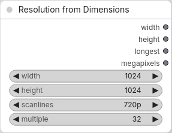
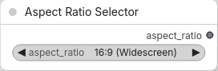

# ComfyUI-ResolutionHelper
Resolution Picker and Calculator

ComfyUI has several custom nodes for selecting image resolution, but they typically require either width and height or megapixels as inputs. I wanted to specify the resolution using the vertical resolution (720p, 1080p, etc.), as is commonly done for display resolutions.

Note that selecting a resolution such as 720p does not necessarily produce the exact dimensions of 1280x720. Instead, it returns dimensions that give the same number of pixels as a 1280x720 image. In other words, selecting 720p gives you 720p's worth of pixels, rather than forcing the image to be exactly 1280x720.

The available aspect ratio selection nodes also provide only a limited set of options. For example, many of them don't include a 16:10 aspect ratio.

# 5 nodes

<table>
  <tr>
    <th style="width: 33.33%;">Resolution from Megapixels</th>
    <th style="width: 33.33%;">Resolution from Scanlines</th>
    <th style="width: 33.33%;">Resolution from Dimensions</th>
  </tr>
  <tr>
    <td style="width: 33.33%; vertical-align: top;">
      Aspect Ratio + MegaPixels => Width &amp; Height 
      
    </td>
    <td style="width: 33.33%; vertical-align: top;">
      Aspect Ratio + Scanlines (height) => Width &amp; Height 
      
    </td>
    <td style="width: 33.33%; vertical-align: top;">
      Width + Height + Scanlines (height) => Width &amp; Height 
      
    </td>
  </tr>
</table>

 

<table style="width: 66.66%;">
  <tr>
    <th style="width: 33.33%;">Aspect Ratio selector</th>
    <th style="width: 33.33%;">Resolution Calculator</th>
  </tr>
  <tr>
    <td style="width: 33.33%; vertical-align: top;">
       can be linked to 1 of the 3 Resolution-from nodes 
      
    </td>
    <td style="width: 33.33%; vertical-align: top;">
      Input Image + Scanlines (height) => Width, Height 
      (this just calculates the resolution, it does not resize the image)
      
    </td>
  </tr>
</table>
