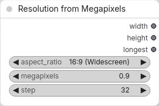
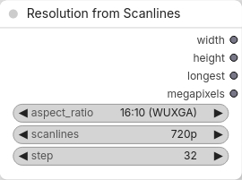
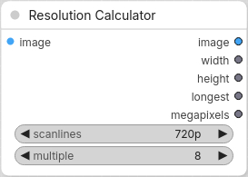

# ComfyUI-ResolutionHelper
Resolution Picker and Calculator

# 3 nodes
## Resolution from Megapixels
Aspect Ratio + MegaPixels => Width & Height 

## Resolution from Scanlines
Aspect Ratio + Scanlines (height) => Width & Height 

## Resolution Calculator
Input Image + Scanlines (height) => Width, Height 

